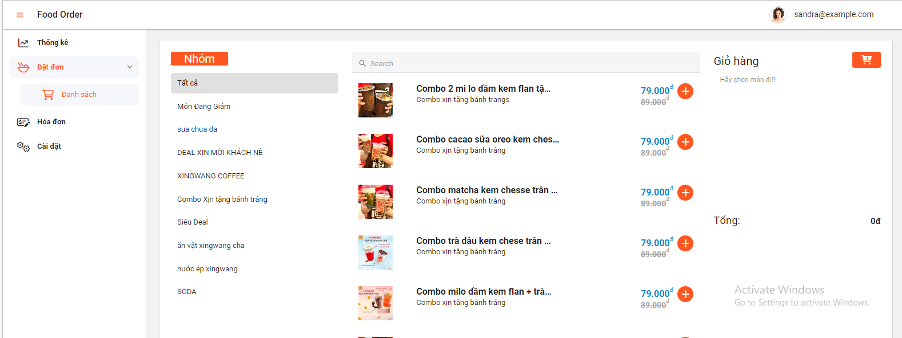

# ReactJs + DevExtreme + Vite Template

This is the repository template for creating new examples.

- **Framework**
    - ReactJs - DevExtreme
- **Build Tool**    
    - Vite4

## Quick Start

- Clone the repo: ``

### Installation

``` bash
$ npm install
```

or

``` bash
$ yarn install
```

### Basic usage

``` bash
# dev server with hot reload at http://localhost:3000
$ npm start 
```

or 

``` bash
# dev server with hot reload at http://localhost:3000
$ yarn start
```

Navigate to [http://localhost:3000](http://localhost:3000). The app will automatically reload if you change any of the source files.

#### Build

Run `build` to build the project. The build artifacts will be stored in the `build/` directory.

```bash
# build for production with minification
$ npm run build
```

or

```bash
# build for production with minification
$ yarn build
```